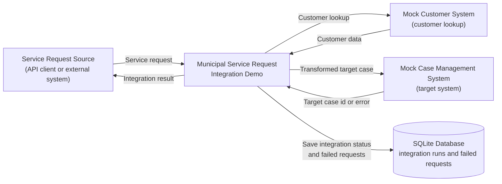

## 1. Purpose

### Project purpose

This is a junior-level learning project that demonstrates a small integration process between a public service request system and a case management system.

In this demo a client can send it a service request that is then validated, enriched with customer data, and then tranformed in to a target case, and the system then simulates sending it to a case management system.

The idea behind this project was to create a simple working demo system of APIs and database management and not a complete, field ready production system.

AI was used in this project.
You can find more information about it in docs\ai-usage.md

### Learning goals

The goal is to practice API design, data validation, data transformation, error handling, idempotency, automated testing, and documentation.

## 2. System context diagram

This diagram shows the main systems involved in the demo and the high-level data flow between them. 
The integration demo receives a service request, uses mock systems for customer lookup and case creation, and stores integration results in a local SQLite database. 
Internal implementation details are described in later sections.

* [**database.py**](src\integration_demo\database.py) creates the database management logic with SQLite and creates the main database for the system to store data.
This creates a integration_demo.db to store integration run history and failed messages.

* [**integration_service.py**](src\integration_demo\integration_service.py) contains the main intergration workflow for processing service requests.
It connects the database, mock customer data, transformer, and target system simulation together.
It handles successful requests, duplicate requests, and failed requests, and returns an Integration Result for the API response.

* [**main.py**](src\integration_demo\main.py) contains the FastApi application and defines all of the API endpoints used by the system.
It is also responsible for launching the app and keeping it running with uvicorn.

* [**mock_data.py**](src\integration_demo\mock_data.py) contains mock customer data and helper functions that simulate an external customer case management system.
In a real scenario this could be replaced with proper api calls to another system.

* [**models.py**](src\integration_demo\models.py) contains the shared Pydantic models used throughout the system.
These models define the expected format of servide requests, customers and target cases.

* [**transformer.py**](src\integration_demo\transformer.py) takes the service request data and customer data, and transforms it in to the case format the external target system expects.

### Development stack explanation and reasoning:

* **FastApi** was used as a fast and easy way to setup API:s for this application.

* **Pydantic** was used to help with data validation and serialisation in order to make communication with api:s safer and easier.
It was also useful in creating the main api documentation since you can automatically get the proper endpoint request and response formats out of it when used with FastApi.

* **SQLite** is used as a serverless database manager.