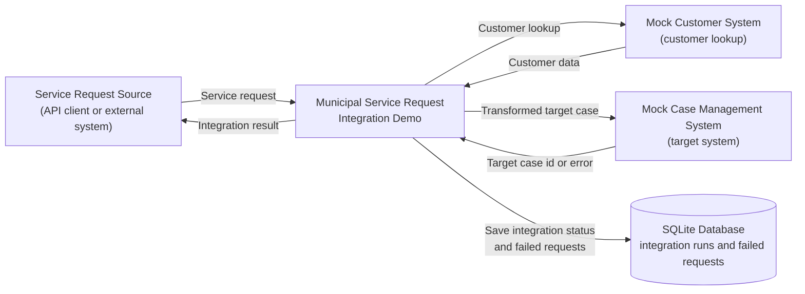
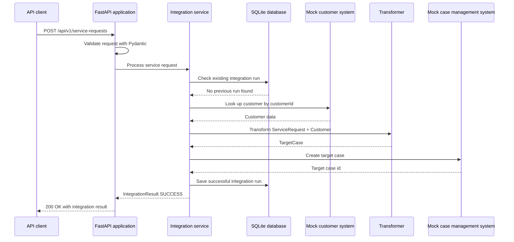
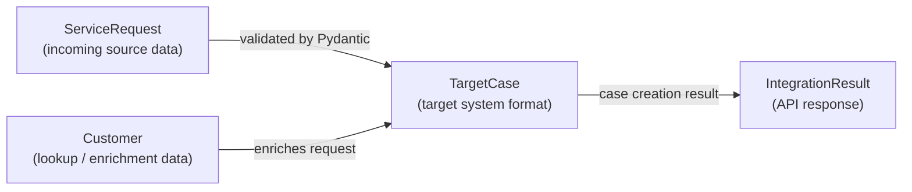
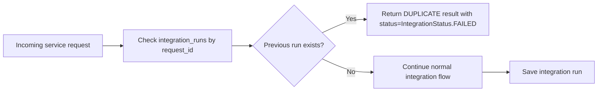

## 1. Purpose

### Project purpose

This is a junior-level learning project that demonstrates a small integration process between a public service request system and a case management system.

In this demo a client can send it a service request that is then validated, enriched with customer data, and then tranformed in to a target case, and the system then simulates sending it to a case management system.

The idea behind this project was to create a simple working demo system of APIs and database management and not a complete, field ready production system.

AI was used in this project.
You can find more information about it in docs\ai-usage.md

### Learning goals

The goal is to practice API design, data validation, data transformation, error handling, idempotency, automated testing, and documentation.

## 2. System context diagram

This Mermaid diagram shows the main systems involved in the demo and the high-level data flow between them. 

Internal implementation details are described in later sections.



## 3. Integration Flow

A flow diagram of an example 'happy path' API service request.

The integration demo receives a service request, uses mock systems for customer lookup and case creation, and stores integration results in a local SQLite database. 




## 4. Components

#### 1. API layer

* [**main.py**](../src/integration_demo/main.py) contains the FastApi application and defines all of the API endpoints used by the system.
It is also responsible for launching the app and keeping it running with uvicorn.

#### 2. Data models

* [**models.py**](../src/integration_demo/models.py) contains the shared Pydantic models used throughout the system.
These models define the expected format of servide requests, customers and target cases.

#### 3. Integration orchestration

* [**integration_service.py**](../src/integration_demo/integration_service.py) contains the main intergration workflow for processing service requests.
It connects the database, mock customer data, transformer, and target system simulation together.
It handles successful requests, duplicate requests, and failed requests, and returns an Integration Result for the API response.

#### 4. Transformation logic

* [**transformer.py**](../src/integration_demo/transformer.py) takes the service request data and customer data, and transforms it in to the case format the external target system expects.

#### 5. Mock external systems

* [**mock_data.py**](../src/integration_demo/mock_data.py) contains mock customer data and helper functions that simulate an external customer case management system.
In a real scenario this could be replaced with proper api calls to another system.

#### 6. Persistence layer

* [**database.py**](../src/integration_demo/database.py) creates the database management logic with SQLite and creates the main database for the system to store data.
This creates a integration_demo.db to store integration run history and failed messages.

## 5. Data model overview

The integration uses Pydantic models to define the structure of the data that moves through the app. These models make the boundaries between the source request, customer lookup data, target system data, and API response explicit.

The main data transformation in this demo is:

```text
ServiceRequest + Customer -> TargetCase -> IntegrationResult
```

`ServiceRequest` represents the incoming request from the source system. The integration enriches it with `Customer` data from the mock customer system and transforms the combined data into a `TargetCase`, which represents the format expected by the mock case management system. The final response returned to the API caller is represented by `IntegrationResult`.



| Model | Role in the integration | Notes |
|---|---|---|
| `ServiceRequest` | Incoming request from the source system | Contains the request id, customer id, service type, description, and priority |
| `Customer` | Customer data used to enrich the service request | Returned by the mock customer system |
| `TargetCase` | Target format sent to the mock case management system | Created by the transformation logic |
| `IntegrationResult` | Response returned to the API caller | Contains the final status, message, and optional target case id |
| `Priority` | Defines allowed priority values | Used to calculate the SLA |
| `ServiceType` | Defines allowed service request types | Used to map the request to a case title and case type |
| `IntegrationStatus` | Defines possible integration result states | Used for success, failed, and duplicate outcomes |

### Source-to-target transformation

The source system and target system use different data structures. The source system sends a `ServiceRequest`, but the mock case management system expects a `TargetCase`.

The transformation step combines the incoming service request with customer data and applies simple mapping rules. For example, the service type is mapped into a case title and case type, while the priority is used to calculate an SLA value.

Keeping this transformation logic separate from the main orchestration flow makes the application easier to understand, test, and extend.

### Use of enums

The project uses enums for values such as priority, service type, and integration status. This helps keep the accepted values explicit and prevents unsupported values from moving further into the integration flow.

For example, invalid service types or priority values are rejected during validation instead of being handled later in the process. This makes the integration more predictable and easier to debug.

## 6. Error handling

The integration separates request validation errors from processing errors.

Invalid request payloads are rejected by FastAPI and Pydantic before the integration flow starts. If the request is valid but the processing fails later, the integration records the failure so that it can be investigated afterwards.

| Scenario | Where it is detected | Behaviour |
|---|---|---|
| Invalid request payload | API layer / Pydantic validation | The request is rejected before the integration flow starts |
| Unknown customer | Integration service / mock customer lookup | The integration run is marked as `FAILED` |
| Target system error | Mock case management system | The integration run is marked as `FAILED` and the request is stored as a dead letter |
| Unexpected processing error | Integration service | The integration run is marked as `FAILED` and the error is stored for later investigation |
| Duplicate request id | Integration service / database lookup | The request is not processed again and a duplicate result is returned |

### Failed integration runs

When processing fails after the integration flow has started, the failure is stored as an integration run with status `FAILED`. This makes the result visible through the integration run lookup endpoint and helps with debugging.

The stored failure includes the request id, status, message, and timestamp.

### Dead letter storage

This project uses a simplified dead letter concept. Failed requests are stored in the local SQLite database so they can be reviewed later.

In a production integration platform, a similar idea could be implemented with a dead-letter queue, monitoring tools, or platform-specific error handling. In this demo, the goal is to show the basic concept without adding a full messaging system.

### Duplicate requests

Duplicate request handling is treated as a controlled integration scenario rather than an unexpected failure. It is described separately in the Idempotency section.

## 7. Idempotency

Idempotency is used to prevent the same service request from being processed multiple times.

In integration scenarios, the same request may be sent more than once because of retries, network issues, timeouts, or user actions. Without idempotency, this could create duplicate cases in the target case management system.

This demo uses the service request id as the idempotency key.

```text
requestId -> request_id
```

Before creating a new target case, the integration service checks whether an integration run already exists for the same request id. If a previous run is found, the request is not processed again.



The idempotency check is handled in the integration orchestration layer before customer lookup, transformation, and target case creation. This prevents unnecessary calls to the mock customer system and avoids creating duplicate target cases.

This is a simplified local implementation. In a production system, idempotency could also involve a dedicated idempotency key, request hashing, distributed locking, message deduplication, or database constraints depending on the architecture.

## 8. Persistence

The demo uses a local SQLite database to store integration run history and failed requests. The database is used to make the integration flow traceable and to support idempotency checks.

The database is initialized when the FastAPI application starts. If the required tables do not exist, they are created automatically.

### Stored data

| Table | Purpose |
|---|---|
| `integration_runs` | Stores the processing result for each service request |
| `dead_letters` | Stores failed requests for later investigation |

### `integration_runs`

The `integration_runs` table stores the result of each processed service request. This makes it possible to check what happened to a specific request after it has been submitted.

The stored data includes the request id, processing status, message, optional target case id, and creation timestamp.

This table is also used for idempotency. Before the integration creates a new target case, it checks whether an integration run already exists for the same request id. If a previous run exists, the request is not processed again.

### `dead_letters`

The `dead_letters` table stores failed requests in a simplified dead letter format. This makes it possible to inspect the original request payload and the error message after a failure.

In this demo, dead letter storage is implemented as a local database table. In a production integration architecture, a similar concept could be implemented with a message queue, dead-letter queue, monitoring platform, or integration platform specific error handling.

### Persistence limitations

This persistence approach is intentionally simple and local to the demo.

It does not include database migrations, distributed locking, production monitoring, retention policies, or advanced retry handling. These would be important considerations in a production integration system, but they are outside the scope of this learning project.

## 9. Design decisions

## 9. Design decisions and development stack

This project was designed as a small local integration demo. The goal was to keep the implementation understandable while still demonstrating important integration concepts such as API design, validation, transformation, error handling, idempotency, persistence, automated testing, and documentation.

| Area | Choice | Reason | Trade-off / limitation |
|---|---|---|---|
| Programming language | Python | Python is readable, approachable, and suitable for building a small API-based integration demo | It is used here for learning and demonstration, not as a claim that Python is the only suitable integration technology |
| API layer | FastAPI | FastAPI makes it straightforward to expose REST endpoints and provides automatic OpenAPI documentation | This does not represent a full API gateway or production integration platform |
| Data validation | Pydantic | Pydantic makes request and response structures explicit, rejects invalid input early, and works well with FastAPI documentation | Validation is implemented locally inside the application |
| Persistence | SQLite | SQLite is lightweight, runs locally without a separate database server, and is enough for storing integration runs and failed requests in this demo | It is not a distributed or production-grade persistence solution |
| External dependencies | Mock systems | Mock systems make the demo easy to run without external accounts, credentials, or network dependencies | They do not fully represent real external API behaviour |
| Transformation logic | Separate `transformer.py` module | Keeping mapping rules separate makes the integration flow easier to read, test, and extend | This adds more structure than a very small script would need |
| Project configuration | `pyproject.toml` | Keeps project metadata, dependencies, and tool configuration in one place | Requires some familiarity with modern Python project structure |
| Diagrams | Mermaid | Mermaid allows diagrams to be stored as text in version control and rendered in GitHub Markdown | Diagrams must be kept in sync with the implementation |
| Code quality | Ruff | Ruff helps keep formatting and linting consistent | It does not replace code review or automated tests |
| Automated tests | pytest and Robot Framework | pytest can test Python logic, while Robot Framework can test API flows from a user/client perspective | Test automation is important with Constant Iteration workflows and DevOps. |
| Platform scope | Platform-neutral local implementation | The project focuses on integration concepts instead of a specific vendor tool | Azure, MuleSoft, and Frends are discussed conceptually in `docs/platform-mapping.md` |