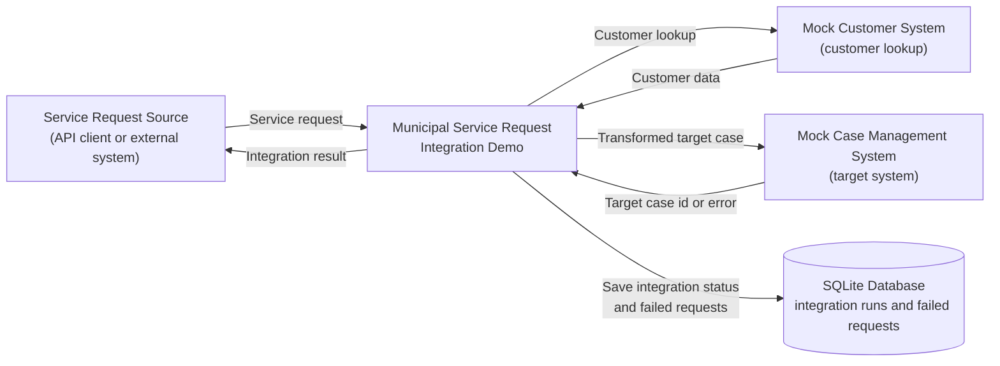
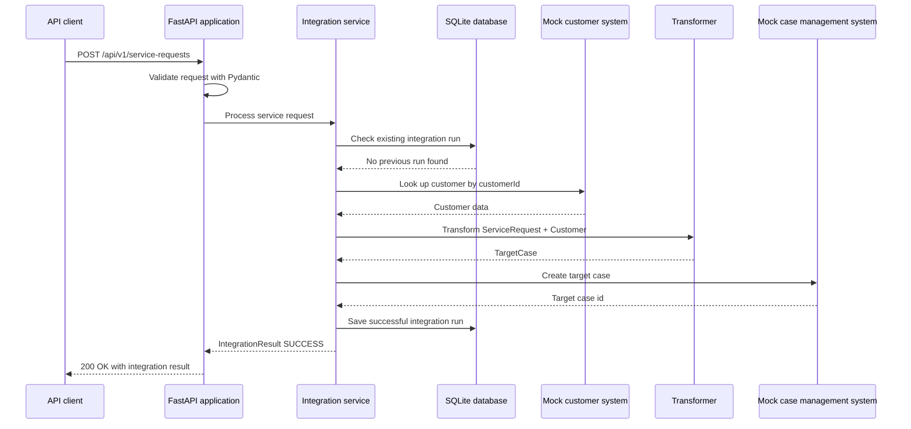
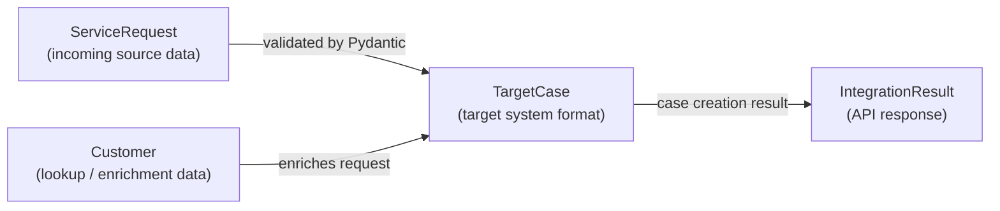

## 1. Purpose

### Project purpose

This is a junior-level learning project that demonstrates a small integration process between a public service request system and a case management system.

In this demo a client can send it a service request that is then validated, enriched with customer data, and then tranformed in to a target case, and the system then simulates sending it to a case management system.

The idea behind this project was to create a simple working demo system of APIs and database management and not a complete, field ready production system.

AI was used in this project.
You can find more information about it in docs\ai-usage.md

### Learning goals

The goal is to practice API design, data validation, data transformation, error handling, idempotency, automated testing, and documentation.

## 2. System context diagram

This Mermaid diagram shows the main systems involved in the demo and the high-level data flow between them. 

Internal implementation details are described in later sections.



## 3. Integration Flow

A flow diagram of an example 'happy path' API service request.

The integration demo receives a service request, uses mock systems for customer lookup and case creation, and stores integration results in a local SQLite database. 




## 4. Components

#### 1. API layer

* [**main.py**](../src/integration_demo/main.py) contains the FastApi application and defines all of the API endpoints used by the system.
It is also responsible for launching the app and keeping it running with uvicorn.

#### 2. Data models

* [**models.py**](../src/integration_demo/models.py) contains the shared Pydantic models used throughout the system.
These models define the expected format of servide requests, customers and target cases.

#### 3. Integration orchestration

* [**integration_service.py**](../src/integration_demo/integration_service.py) contains the main intergration workflow for processing service requests.
It connects the database, mock customer data, transformer, and target system simulation together.
It handles successful requests, duplicate requests, and failed requests, and returns an Integration Result for the API response.

#### 4. Transformation logic

* [**transformer.py**](../src/integration_demo/transformer.py) takes the service request data and customer data, and transforms it in to the case format the external target system expects.

#### 5. Mock external systems

* [**mock_data.py**](../src/integration_demo/mock_data.py) contains mock customer data and helper functions that simulate an external customer case management system.
In a real scenario this could be replaced with proper api calls to another system.

#### 6. Persistence layer

* [**database.py**](../src/integration_demo/database.py) creates the database management logic with SQLite and creates the main database for the system to store data.
This creates a integration_demo.db to store integration run history and failed messages.

## 5. Data model overview

The integration uses Pydantic models to define the structure of the data that moves through the app. These models make the boundaries between the source request, customer lookup data, target system data, and API response explicit.

The main data transformation in this demo is:

```text
ServiceRequest + Customer -> TargetCase -> IntegrationResult
```

`ServiceRequest` represents the incoming request from the source system. The integration enriches it with `Customer` data from the mock customer system and transforms the combined data into a `TargetCase`, which represents the format expected by the mock case management system. The final response returned to the API caller is represented by `IntegrationResult`.



| Model | Role in the integration | Notes |
|---|---|---|
| `ServiceRequest` | Incoming request from the source system | Contains the request id, customer id, service type, description, and priority |
| `Customer` | Customer data used to enrich the service request | Returned by the mock customer system |
| `TargetCase` | Target format sent to the mock case management system | Created by the transformation logic |
| `IntegrationResult` | Response returned to the API caller | Contains the final status, message, and optional target case id |
| `Priority` | Defines allowed priority values | Used to calculate the SLA |
| `ServiceType` | Defines allowed service request types | Used to map the request to a case title and case type |
| `IntegrationStatus` | Defines possible integration result states | Used for success, failed, and duplicate outcomes |

### Source-to-target transformation

The source system and target system use different data structures. The source system sends a `ServiceRequest`, but the mock case management system expects a `TargetCase`.

The transformation step combines the incoming service request with customer data and applies simple mapping rules. For example, the service type is mapped into a case title and case type, while the priority is used to calculate an SLA value.

Keeping this transformation logic separate from the main orchestration flow makes the application easier to understand, test, and extend.

### Use of enums

The project uses enums for values such as priority, service type, and integration status. This helps keep the accepted values explicit and prevents unsupported values from moving further into the integration flow.

For example, invalid service types or priority values are rejected during validation instead of being handled later in the process. This makes the integration more predictable and easier to debug.


### Development stack explanation and reasoning:

* **FastApi** was used as a fast and easy way to setup API:s for this application.

* **Pydantic** was used to help with data validation and serialisation in order to make communication with api:s safer and easier.
It was also useful in creating the main api documentation since you can automatically get the proper endpoint request and response formats out of it when used with FastApi.

* **SQLite** is used as a serverless database manager.