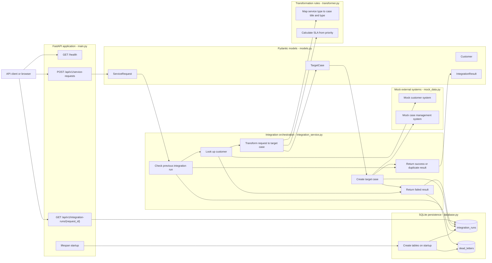

# Platform Mapping

This project is a small integration demo for municipal service requests. It
models the same basic responsibilities that larger integration platforms often
handle: receiving an API request, validating data, transforming it into a target
format, calling another system, tracking processing status, and storing failed
messages for later analysis.

## System Map

The diagram below is a Mermaid flowchart that shows how the main source files
and system responsibilities connect to each other.

## Platform Responsibilities

| Platform concept | Where it appears in this project | Purpose |
| --- | --- | --- |
| API gateway or inbound API | `main.py` | Exposes HTTP endpoints for health checks, new service requests, and integration-run lookup. |
| Data contract and validation | `models.py` | Uses Pydantic models to define accepted request data and returned result data. |
| Orchestration | `integration_service.py` | Controls the process flow from duplicate check to customer lookup, transformation, target creation, and error handling. |
| Transformation | `transformer.py` | Converts an inbound municipal service request into the target case format. |
| Source or reference system | `mock_data.py` customer data | Simulates looking up customer information from another system. |
| Target system | `mock_data.py` case creation | Simulates sending the transformed case to a case management system. |
| Operational tracking | `database.py` `integration_runs` table | Stores status, messages, target case IDs, and timestamps for processed requests. |
| Dead-letter handling | `database.py` `dead_letters` table | Stores failed payloads and error messages for later inspection. |

## Main Flow

1. A client sends a service request to `POST /api/v1/service-requests`.
2. FastAPI validates the request using the `ServiceRequest` Pydantic model.
3. The integration service checks whether the request ID has already been processed.
4. If the request is new, the service looks up the customer from mock customer data.
5. The transformer maps the request into a `TargetCase`.
6. The mock case management function creates a fake target case ID.
7. The result is saved into `integration_runs` and returned as an `IntegrationResult`.
8. If processing fails, the failed run is saved and the payload is written to `dead_letters`.
